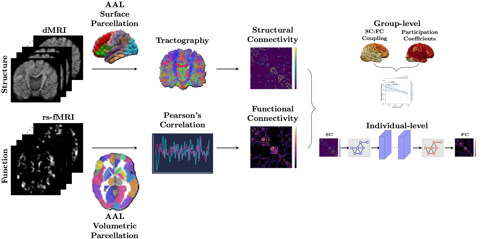
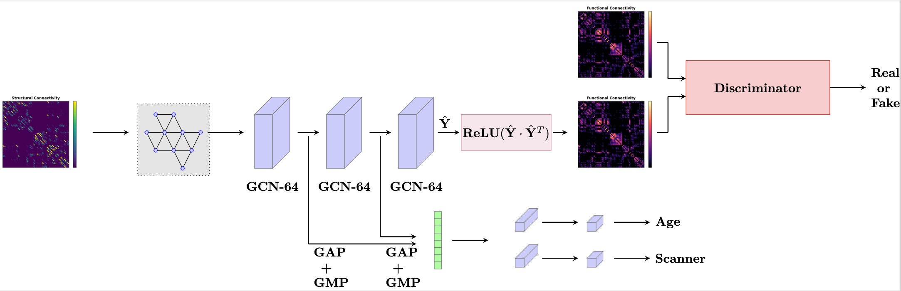

# SCFC
<div align="center">
    
</div>
This repository provides pytorch implementation of the following paper:

>**Structural and functional connectome relationships in early childhood**

>Yoonmi Hong, Emil Cornea, Jessica B. Girault, Maria Bagonis, Mark Foster, Sun Hyung Kim, Juan Carlos Prieto, Haitao Chen, Wei Gao, Martin A. Styner, and John H. Gilmore <br>
>**Abstract**
There is strong evidence that the functional connectome is highly related to the white matter connectome in older children and adults, though little is known about structure-function relationships in early childhood. We investigated the development of cortical structure-function coupling in children longitudinally scanned at 1, 2, 4, and 6 years of age (N = 360) and in a comparison sample of adults (N = 89). We also applied a novel graph convolutional neural network-based deep learning model with a new loss function to better capture inter-subject heterogeneity and predict an individual’s functional connectivity from the corresponding structural connectivity. We found regional patterns of structure-function coupling in early childhood that were consistent with adult patterns. In addition, our deep learning model improved the prediction of individual functional connectivity from its structural counterpart compared to existing models.

## Usage

### Train

### Test

## Architrecture

<div align="center">
    
</div>

## Citation
```
@article{hong2023structural,
  title={Structural and functional connectome relationships in early childhood},
  author={Hong, Yoonmi and Cornea, Emil and Girault, Jessica B and Bagonis, Maria and Foster, Mark and Kim, Sun Hyung and Prieto, Juan Carlos and Chen, Haitao and Gao, Wei and Styner, Martin A and others},
  journal={Developmental Cognitive Neuroscience},
  pages={101314},
  year={2023},
  publisher={Elsevier}
}
```
